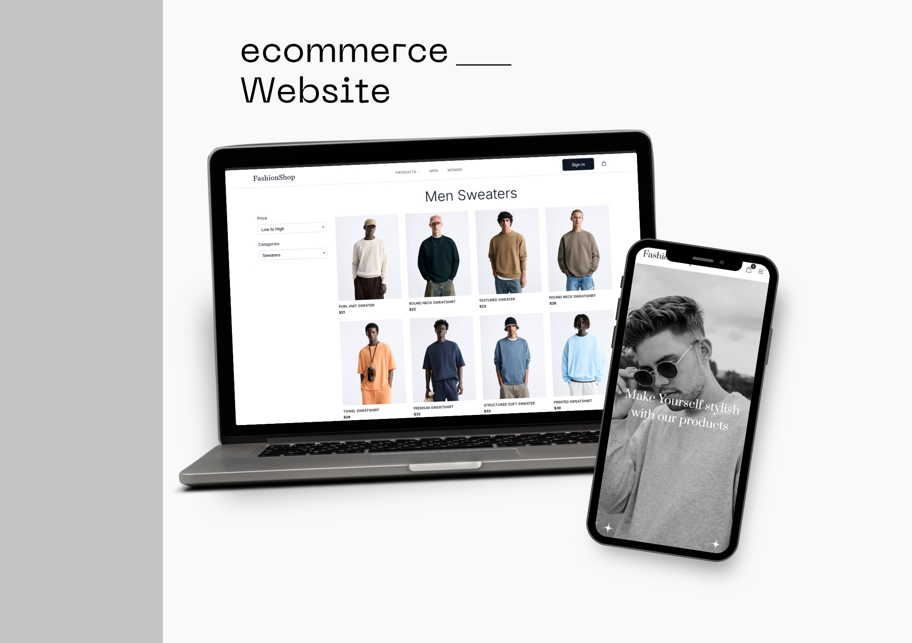

# Fashion Shop - Modern E-commerce React Application

A modern, responsive e-commerce fashion store built with React, Tailwind CSS, and React Router. This application showcases a complete online shopping experience with product browsing, cart management, and responsive design optimized for both men's and women's fashion collections.



## Live Demo

[View Live Fashion Shop](https://your-fashion-shop-demo.com)

## Table of Contents

- [Overview](#overview)
- [Tech Stack](#tech-stack)
- [Project Structure](#project-structure)
- [Features Overview](#features-overview)
- [Technical Implementation](#technical-implementation)
- [Performance Optimizations](#performance-optimizations)
- [Responsive Design](#responsive-design)
- [State Management](#state-management)
- [Setup Instructions](#setup-instructions)
- [Deployment](#deployment)
- [Future Features](#future-features)
- [About the Project](#about-the-project)

## Overview

This fashion e-commerce application represents my journey into modern React development and e-commerce solutions. Built as a learning project to master React hooks, state management, and responsive design, this application showcases a complete online shopping experience with product browsing, cart management, and responsive design optimized for both men's and women's fashion collections.

### My Story with This Project

As a frontend developer looking to expand my skills beyond basic React applications, I decided to tackle the challenge of building a full-featured e-commerce platform. This project became my gateway to understanding complex state management, user experience design, and the intricacies of modern web development.

**Why I Built This Project:**

- To master React Context API and global state management
- To learn responsive design principles with Tailwind CSS
- To understand e-commerce user flows and UX patterns
- To practice modern React patterns and hooks
- To build a portfolio piece that demonstrates real-world application skills

**Challenges I Faced and How I Solved Them:**

1. **State Management Complexity**

   - **Problem**: Managing cart state across multiple components without prop drilling
   - **Solution**: Implemented React Context API with CartContext for centralized state management
   - **Learning**: Mastered context patterns, learned about performance optimization with proper context usage

2. **Responsive Design Implementation**

   - **Problem**: Creating a seamless experience across mobile, tablet, and desktop
   - **Solution**: Adopted mobile-first approach with Tailwind CSS utility classes
   - **Learning**: Understood the importance of progressive enhancement and touch-friendly interfaces

3. **Cart Persistence and Data Management**

   - **Problem**: Maintaining cart state across browser sessions and page refreshes
   - **Solution**: Integrated localStorage with React Context for persistent cart storage
   - **Learning**: Learned about browser storage APIs and state synchronization

4. **Image Optimization and Performance**

   - **Problem**: Large product images causing slow loading times
   - **Solution**: Implemented responsive images with multiple resolutions and lazy loading
   - **Learning**: Mastered modern image optimization techniques and performance best practices

5. **Routing and Navigation Structure**
   - **Problem**: Creating intuitive navigation between product categories and details
   - **Solution**: Structured React Router implementation with nested routes and dynamic parameters
   - **Learning**: Understood SPA routing patterns and URL structure for e-commerce

**What I Learned from This Project:**

- **Advanced React Patterns**: Context API, custom hooks, and component composition
- **E-commerce UX Design**: User journey mapping and conversion optimization
- **Performance Optimization**: Image optimization, code splitting, and efficient rendering
- **Responsive Design**: Mobile-first development and cross-device compatibility
- **State Management**: Global state patterns and data persistence strategies
- **Modern Build Tools**: Vite configuration and modern JavaScript bundling
- **Code Architecture**: Component organization and separation of concerns

This project transformed my understanding of React development from basic component building to architecting complete applications with real-world functionality.

## Tech Stack

- **Frontend Framework**: React 19 with Hooks
- **Styling**: Tailwind CSS 4
- **Routing**: React Router v7
- **State Management**: React Context API
- **Build Tool**: Vite
- **Icons**: React Icons
- **Image Optimization**: Modern image formats with responsive loading
- **Deployment**: Vercel/Netlify ready

## Project Structure

```
src/
├── components/          # Reusable UI components
│   ├── aside/           # Sidebar components
│   ├── cards/           # Product card components
│   ├── cart/            # Shopping cart components
│   ├── footer/          # Site footer
│   ├── header/          # Navigation header
│   ├── layout/          # Main layout wrapper
│   ├── product-detail/ # Product detail components
│   └── ui/              # Generic UI components
├── contexts/            # React Context providers
│   └── CartContext.jsx  # Shopping cart state management
├── data/                # Product data and mock API
│   ├── menProducts.js   # Men's fashion products
│   └── womenProducts.js # Women's fashion products
├── hooks/               # Custom React hooks
├── pages/               # Route components
│   ├── cart/            # Shopping cart page
│   ├── men/             # Men's products pages
│   ├── women/           # Women's products pages
│   └── Home.jsx         # Home page
├── sections/            # Main page sections
│   ├── hero/            # Hero banner section
│   ├── products-guide/  # Product navigation
│   └── variety-of-fashion/ # Product showcase
├── assets/              # Static assets
│   └── images/          # Product and UI images
├── App.jsx              # Main application component
└── main.jsx             # Application entry point
```

## Features Overview

### Header Navigation

**Purpose**: Primary navigation and branding
**Value**: Provides clear navigation and establishes brand identity
**Implementation**:

- Responsive navigation with mobile hamburger menu
- Logo with smooth scroll to home section
- Desktop navigation with active state management
- Shopping cart icon with item count indicator
- Mobile-first responsive design

**Technical Details**:

- Fixed position with scroll-based styling changes
- React Router integration for navigation
- Cart context integration for item count
- Touch gesture support for mobile menu
- Accessibility features (ARIA labels, keyboard navigation)

### Hero Section

**Purpose**: First impression and brand showcase
**Value**: Immediately communicates brand identity and featured products
**Implementation**:

- Large hero image with overlay text
- Call-to-action buttons for product browsing
- Responsive background images
- Smooth animations and transitions

**Technical Details**:

- Responsive images with multiple resolutions
- CSS animations for entrance effects
- Interactive elements with hover effects
- Performance-optimized image loading

### Product Browsing

**Purpose**: Product discovery and exploration
**Value**: Enables customers to find products they want
**Implementation**:

- Separate men's and women's product sections
- Product grid with hover effects
- Category filtering and organization
- Product cards with essential information

**Technical Details**:

- Dynamic product data from JSON files
- Responsive grid layout with CSS Grid
- Image lazy loading for performance
- Hover effects with smooth transitions

### Product Detail Pages

**Purpose**: Detailed product information and purchase decisions
**Value**: Provides comprehensive product details for informed buying
**Implementation**:

- Large product images with zoom functionality
- Detailed product information and specifications
- Size selection with availability
- Add to cart functionality
- Related products suggestions

**Technical Details**:

- Dynamic routing with React Router
- Image gallery with multiple views
- Form validation for size selection
- Cart context integration
- Responsive image optimization

### Shopping Cart

**Purpose**: Cart management and checkout preparation
**Value**: Enables customers to review and modify their selections
**Implementation**:

- Sidebar cart with slide-out animation
- Item quantity management
- Price calculations and totals
- Item removal with confirmation
- Persistent cart storage

**Technical Details**:

- React Context for state management
- LocalStorage persistence
- Smooth animations with CSS transitions
- Form validation and error handling
- Mobile-optimized touch interactions

### Cart Page

**Purpose**: Complete cart review and checkout preparation
**Value**: Provides detailed cart review before purchase
**Implementation**:

- Full-page cart view
- Detailed item information
- Quantity adjustment controls
- Total price calculations
- Clear cart functionality

**Technical Details**:

- Responsive table layout
- Real-time price updates
- Form validation and error handling
- Accessibility features
- Mobile-optimized layout

### Footer

**Purpose**: Site closure and additional information
**Value**: Provides secondary navigation and company information
**Implementation**:

- Company information and links
- Social media integration
- Newsletter signup (placeholder)
- Copyright information
- Clean, minimal design

**Technical Details**:

- Responsive layout with flexbox
- Social media integration
- Accessibility features
- Performance optimization

## Technical Implementation

### Why React Context API?

- **State Management**: Centralized cart state management
- **Performance**: Efficient re-rendering with proper context usage
- **Simplicity**: No external dependencies for basic state management
- **Scalability**: Easy to extend for additional features

### Why Tailwind CSS?

- **Utility-First**: Rapid development with utility classes
- **Responsive Design**: Built-in responsive utilities
- **Customization**: Easy theme customization and extension
- **Performance**: Purged CSS for optimal bundle size

### Why Vite?

- **Fast Development**: Lightning-fast HMR and build times
- **Modern Tooling**: ES modules and modern JavaScript support
- **Optimized Builds**: Rollup-based production builds
- **Developer Experience**: Excellent TypeScript and React support

### Why React Router v7?

- **Modern Routing**: Latest routing patterns and features
- **Performance**: Optimized for React 19
- **Developer Experience**: Improved API and better error handling
- **Future-Proof**: Built for modern React applications

## Performance Optimizations

### Image Optimization

- **Responsive Images**: Multiple resolutions for different screen sizes
- **Lazy Loading**: Images load only when needed
- **Modern Formats**: Optimized image formats with fallbacks
- **Efficient Loading**: Proper image sizing and compression

### Code Splitting

- **Route-based Splitting**: Each page loads only necessary code
- **Component Lazy Loading**: Heavy components load on demand
- **Bundle Optimization**: Tree-shaking removes unused code

### State Management

- **Efficient Re-renders**: Optimized context usage to prevent unnecessary renders
- **LocalStorage Integration**: Persistent cart without server calls
- **Debounced Updates**: Optimized form input handling

### Build Optimization

- **Vite Optimization**: Fast builds with modern bundling
- **CSS Purging**: Unused Tailwind classes removed in production
- **Asset Optimization**: Optimized images and static assets

## Responsive Design

### Breakpoints

- **Mobile**: 320px - 768px
- **Tablet**: 769px - 1024px
- **Desktop**: 1025px+

### Mobile-First Approach

- **Progressive Enhancement**: Start with mobile, enhance for larger screens
- **Touch-Friendly**: Optimized touch targets and gestures
- **Performance**: Optimized for mobile network conditions
- **Usability**: Simplified navigation and interactions

### Responsive Images

- **Multiple Resolutions**: Different image sizes for different screens
- **Proper Sizing**: Responsive image sizing with CSS
- **Lazy Loading**: Performance optimization for mobile
- **Modern Formats**: WebP with JPEG fallbacks

## State Management

### Cart Context Implementation

**Features**:

- Add/remove items from cart
- Update item quantities
- Persistent cart storage
- Cart total calculations
- Notification system
- Cart sidebar management

**Technical Details**:

- React Context API for global state
- LocalStorage for persistence
- Optimized re-renders with proper context usage
- Error handling and validation
- Mobile-optimized interactions

### Data Management

**Product Data**:

- Structured JSON data for products
- Consistent data schema
- Easy to extend and modify
- Mock API structure for future backend integration

## Setup Instructions

### Prerequisites

- Node.js (v18 or higher)
- npm or yarn

### Installation

1. **Clone the repository**

   ```bash
   git clone https://github.com/yourusername/fashion-shop.git
   cd fashion-shop
   ```

2. **Install dependencies**

   ```bash
   npm install
   ```

3. **Start development server**

   ```bash
   npm run dev
   ```

4. **Open in browser**
   Navigate to `http://localhost:5173`

### Build for Production

```bash
npm run build
```

The built files will be in the `dist/` directory.

### Preview Production Build

```bash
npm run preview
```

## Deployment

### Vercel Deployment

1. **Connect Repository**

   - Link your GitHub repository to Vercel
   - Set build command: `npm run build`
   - Set output directory: `dist`

2. **Environment Variables**

   - Add any required environment variables in Vercel dashboard

3. **Custom Domain** (Optional)
   - Configure custom domain in Vercel settings

### Netlify Deployment

1. **Connect Repository**

   - Link your GitHub repository to Netlify
   - Set build command: `npm run build`
   - Set publish directory: `dist`

2. **Environment Variables**

   - Add any required environment variables in Netlify dashboard

3. **Custom Domain** (Optional)
   - Configure custom domain in Netlify settings

### React Router Configuration

For proper routing on static hosting platforms, ensure your hosting platform is configured to serve `index.html` for all routes (SPA routing).

## Future Features

### Planned Enhancements

- **User Authentication**

  - User registration and login
  - User profiles and order history
  - Wishlist functionality

- **Backend Integration**

  - Real product database
  - Payment processing (Stripe/PayPal)
  - Order management system
  - Inventory management

- **Advanced Features**

  - Product search and filtering
  - Product reviews and ratings
  - Size guide and recommendations
  - Product comparison tool

- **Performance Improvements**

  - Service worker implementation
  - Offline functionality
  - Advanced caching strategies
  - Image optimization service

- **UI/UX Enhancements**

  - Dark/light mode toggle
  - Advanced animations and micro-interactions
  - Improved accessibility features
  - Progressive Web App capabilities

- **Analytics and SEO**

  - Google Analytics integration
  - SEO optimization
  - Performance monitoring
  - A/B testing capabilities

- **Mobile App**
  - React Native mobile app
  - Push notifications
  - Mobile-specific features

## About the Project

### My Development Journey

This fashion e-commerce application represents a significant milestone in my frontend development journey. Starting as a learning project to understand complex React applications, it evolved into a comprehensive showcase of modern web development skills.

### Project Evolution

**Initial Goals:**

- Learn React Context API for state management
- Master responsive design with Tailwind CSS
- Understand e-commerce user experience patterns
- Build a portfolio-worthy project

**What It Became:**

- A fully functional e-commerce platform
- A demonstration of modern React architecture
- A showcase of problem-solving and technical growth
- A foundation for understanding real-world application development

### Key Learning Moments

**The State Management Breakthrough:**
When I first encountered the challenge of managing cart state across multiple components, I initially tried prop drilling. This quickly became unmanageable, leading me to discover React Context API. The moment I implemented CartContext and saw how clean and efficient state management could be was a turning point in my React understanding.

**The Responsive Design Challenge:**
Building for mobile-first was initially counterintuitive - I was used to desktop-first thinking. Through this project, I learned that mobile-first isn't just about screen sizes, but about progressive enhancement and touch-friendly interactions.

**The Performance Optimization Journey:**
Discovering that large product images were slowing down the application led me down a rabbit hole of image optimization, lazy loading, and performance best practices. This experience taught me that user experience isn't just about functionality, but also about speed and efficiency.

### What This Project Demonstrates

- **Problem-Solving Skills**: How I approached and solved complex development challenges
- **Learning Agility**: My ability to quickly master new technologies and patterns
- **User-Centric Thinking**: Understanding that every technical decision impacts user experience
- **Modern React Mastery**: Advanced patterns, hooks, and state management
- **E-commerce Expertise**: Complete shopping cart and product management functionality
- **Responsive Design**: Mobile-first approach with seamless cross-device experience
- **Performance Awareness**: Image optimization, code splitting, and efficient rendering
- **Professional Architecture**: Clean component structure and separation of concerns

### Technical Skills Highlighted

- **Frontend Technologies**: React 19, JavaScript (ES6+), HTML5, CSS3
- **Styling**: Tailwind CSS, Responsive Design
- **Routing**: React Router v7
- **State Management**: React Context API
- **Build Tools**: Vite, ESLint
- **Development Practices**: Component-based architecture, custom hooks, modern JavaScript

### Product Catalog

The application features a comprehensive product catalog including:

- **Men's Collection**: 24+ products including sweaters, t-shirts, and accessories
- **Women's Collection**: 24+ products including sweaters, t-shirts, and accessories
- **Product Details**: Comprehensive product information, sizing, and specifications
- **Categories**: Organized by product type and gender
- **Pricing**: Competitive pricing with clear display

### Contact

For questions about this project or collaboration opportunities, please reach out through the contact methods provided.

---

_Built with React, Tailwind CSS, and Vite_
